# gux-date-beta

<!-- Auto Generated Below -->

## Slots

| Slot | Description |
| ---- | ----------- |
|      | text        |

## Dependencies

### Used by

 - [gux-context-menu](../../stable/gux-context-menu)
 - [gux-file-list-item](../../stable/gux-form-field/components/gux-form-field-file-beta/components/gux-file-list-item)
 - [gux-icon-tooltip-beta](../gux-icon-tooltip)
 - [gux-inline-alert](../../stable/gux-inline-alert)
 - [gux-label-info-beta](../gux-label-info)
 - [gux-month-calendar](../gux-month-picker/gux-month-calendar)
 - [gux-month-picker-beta](../gux-month-picker)
 - [gux-pagination-cursor](../../stable/gux-pagination-cursor)
 - [gux-rich-text-editor-action](../gux-rich-text-editor/gux-rich-text-editor-action)
 - [gux-rich-text-editor-action-text-highlight](../gux-rich-text-editor/gux-rich-text-editor-action/gux-rich-text-editor-action-text-highlight)
 - [gux-rich-text-editor-menu](../gux-rich-text-editor/gux-rich-text-editor-menu)
 - [gux-side-panel-header](../gux-side-panel/components/gux-side-panel-header)
 - [gux-tab-advanced](../../stable/gux-tabs-advanced/gux-tab-advanced)
 - [gux-tab-advanced-list](../../stable/gux-tabs-advanced/gux-tab-advanced-list)
 - [gux-table-toolbar-menu-button](../../stable/gux-table-toolbar/gux-table-toolbar-menu-button)
 - [gux-tag](../../stable/gux-tag)

### Graph

```mermaid
graph TD;
  gux-context-menu --> gux-screen-reader-beta
  gux-file-list-item --> gux-screen-reader-beta
  gux-icon-tooltip-beta --> gux-screen-reader-beta
  gux-inline-alert --> gux-screen-reader-beta
  gux-label-info-beta --> gux-screen-reader-beta
  gux-month-calendar --> gux-screen-reader-beta
  gux-month-picker-beta --> gux-screen-reader-beta
  gux-pagination-cursor --> gux-screen-reader-beta
  gux-rich-text-editor-action --> gux-screen-reader-beta
  gux-rich-text-editor-action-text-highlight --> gux-screen-reader-beta
  gux-rich-text-editor-menu --> gux-screen-reader-beta
  gux-side-panel-header --> gux-screen-reader-beta
  gux-tab-advanced --> gux-screen-reader-beta
  gux-tab-advanced-list --> gux-screen-reader-beta
  gux-table-toolbar-menu-button --> gux-screen-reader-beta
  gux-tag --> gux-screen-reader-beta
  style gux-screen-reader-beta fill:#f9f,stroke:#333,stroke-width:4px
```

----------------------------------------------

*Built with [StencilJS](https://stenciljs.com/)*
