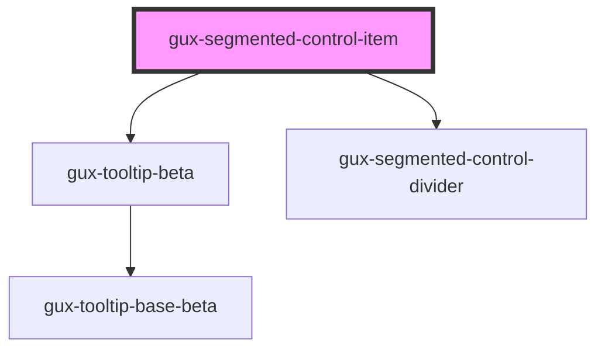

# gux-segmented-control-item

<!-- Auto Generated Below -->

## Properties

| Property   | Attribute   | Description | Type      | Default     |
| ---------- | ----------- | ----------- | --------- | ----------- |
| `disabled` | `disabled`  |             | `boolean` | `false`     |
| `iconOnly` | `icon-only` |             | `boolean` | `false`     |
| `selected` | `selected`  |             | `boolean` | `false`     |
| `value`    | `value`     |             | `string`  | `undefined` |

## Slots

| Slot     | Description               |
| -------- | ------------------------- |
| `"icon"` | optional slot for an icon |
| `"text"` | required slot for text    |

## Dependencies

### Depends on

- [gux-tooltip-beta](../../gux-tooltip-beta)
- [gux-segmented-control-divider](../gux-segmented-control-divider)

### Graph

----------------------------------------------

*Built with [StencilJS](https://stenciljs.com/)*
