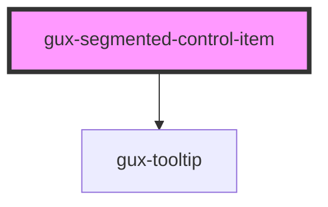

# gux-segmented-control-item

<!-- Auto Generated Below -->

## Properties

| Property   | Attribute   | Description | Type      | Default     |
| ---------- | ----------- | ----------- | --------- | ----------- |
| `disabled` | `disabled`  |             | `boolean` | `false`     |
| `iconOnly` | `icon-only` |             | `boolean` | `false`     |
| `selected` | `selected`  |             | `boolean` | `false`     |
| `value`    | `value`     |             | `string`  | `undefined` |

## Slots

| Slot     | Description               |
| -------- | ------------------------- |
| `"icon"` | optional slot for an icon |
| `"text"` | required slot for text    |

## CSS Custom Properties

| Name                                                        | Description |
| ----------------------------------------------------------- | ----------- |
| `--gse-ui-segmentedControl-borderRadius`                    |             |
| `--gse-ui-segmentedControl-button-active-backgroundColor`   |             |
| `--gse-ui-segmentedControl-button-active-foregroundColor`   |             |
| `--gse-ui-segmentedControl-button-default-backgroundColor`  |             |
| `--gse-ui-segmentedControl-button-default-foregroundColor`  |             |
| `--gse-ui-segmentedControl-button-disabled-backgroundColor` |             |
| `--gse-ui-segmentedControl-button-disabled-foregroundColor` |             |
| `--gse-ui-segmentedControl-button-disabled-opacity`         |             |
| `--gse-ui-segmentedControl-button-end-borderRadius`         |             |
| `--gse-ui-segmentedControl-button-gap`                      |             |
| `--gse-ui-segmentedControl-button-hover-backgroundColor`    |             |
| `--gse-ui-segmentedControl-button-hover-foregroundColor`    |             |
| `--gse-ui-segmentedControl-button-middle-borderRadius`      |             |
| `--gse-ui-segmentedControl-button-padding`                  |             |
| `--gse-ui-segmentedControl-button-start-borderRadius`       |             |
| `--gse-ui-segmentedControl-divider-color`                   |             |
| `--gse-ui-segmentedControl-divider-style`                   |             |
| `--gse-ui-segmentedControl-divider-width`                   |             |
| `--gse-ui-segmentedControl-focus-offset`                    |             |
| `--gse-ui-segmentedControl-height`                          |             |
| `--gse-ui-segmentedControl-iconOnly-padding`                |             |

## Dependencies

### Depends on

- [gux-tooltip](../../../stable/gux-tooltip)

### Graph

----------------------------------------------

*Built with [StencilJS](https://stenciljs.com/)*
