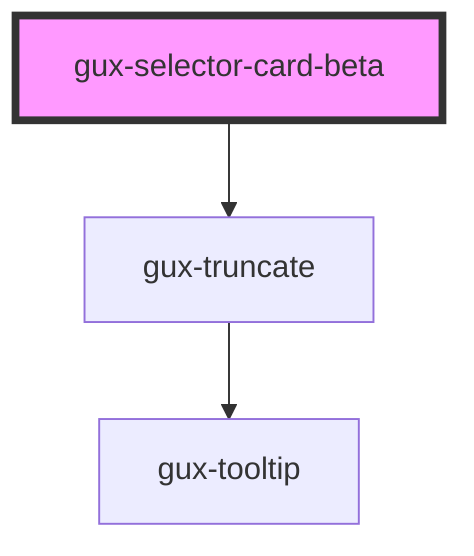

# gux-selector-card

<!-- Auto Generated Below -->

## Properties

| Property  | Attribute | Description | Type                        | Default    |
| --------- | --------- | ----------- | --------------------------- | ---------- |
| `variant` | `variant` |             | `"descriptive" \| "simple"` | `'simple'` |

## Slots

| Slot            | Description                                   |
| --------------- | --------------------------------------------- |
| `"badge"`       | Optional slot for badge                       |
| `"description"` | Optional slot for additional text description |
| `"icon"`        | Required slot for icon                        |
| `"input"`       | Required slot for input tag                   |
| `"label"`       | Required slot for label tag                   |

## Dependencies

### Depends on

- [gux-truncate](../../../stable/gux-truncate)

### Graph

----------------------------------------------

*Built with [StencilJS](https://stenciljs.com/)*
