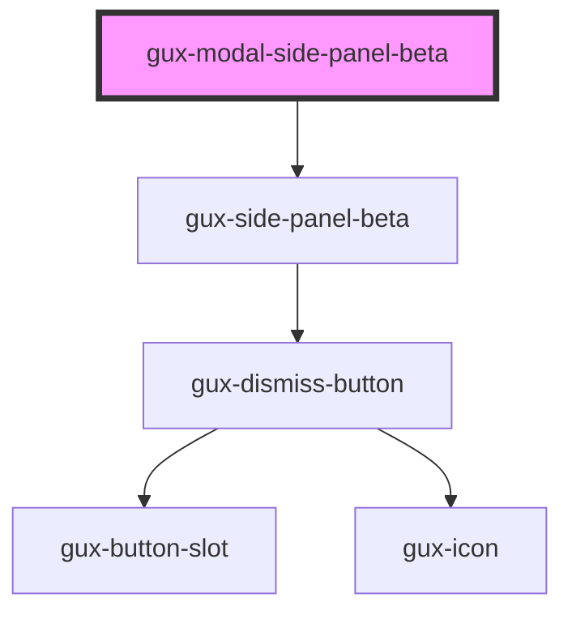

# gux-modal-side-panel-beta

<!-- Auto Generated Below -->

## Properties

| Property | Attribute | Description | Type                             | Default    |
| -------- | --------- | ----------- | -------------------------------- | ---------- |
| `open`   | `open`    |             | `boolean`                        | `false`    |
| `size`   | `size`    |             | `"large" \| "medium" \| "small"` | `'medium'` |

## Events

| Event                   | Description | Type                |
| ----------------------- | ----------- | ------------------- |
| `modalSidePanelDismiss` |             | `CustomEvent<void>` |

## Methods

### `close() => Promise<void>`

#### Returns

Type: `Promise<void>`

### `showModal() => Promise<void>`

#### Returns

Type: `Promise<void>`

## Slots

| Slot            | Description                            |
| --------------- | -------------------------------------- |
| `"content"`     | The content of the side panel          |
| `"description"` | Optional description of the side panel |
| `"footer"`      | The footer of the side panel           |
| `"heading"`     | The heading of the side panel          |

## Dependencies

### Depends on

- [gux-side-panel-beta](../..)

### Graph

----------------------------------------------

*Built with [StencilJS](https://stenciljs.com/)*
