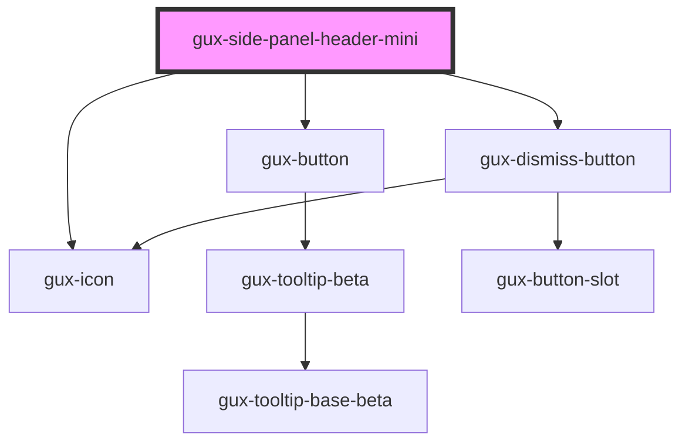

# gux-side-panel-header-mini

<!-- Auto Generated Below -->

## Properties

| Property | Attribute | Description | Type      | Default |
| -------- | --------- | ----------- | --------- | ------- |
| `expand` | `expand`  |             | `boolean` | `false` |

## Events

| Event              | Description | Type                |
| ------------------ | ----------- | ------------------- |
| `sidePanelDismiss` |             | `CustomEvent<void>` |

## Slots

| Slot   | Description                                             |
| ------ | ------------------------------------------------------- |
| `icon` | Icon component displayed on the left side of the header |
|        | Text content for the mini header                        |

## Dependencies

### Depends on

- [gux-button](../../../../stable/gux-button)
- [gux-icon](../../../../stable/gux-icon)
- [gux-dismiss-button](../../../../stable/gux-dismiss-button)

### Graph

---

_Built with [StencilJS](https://stenciljs.com/)_
