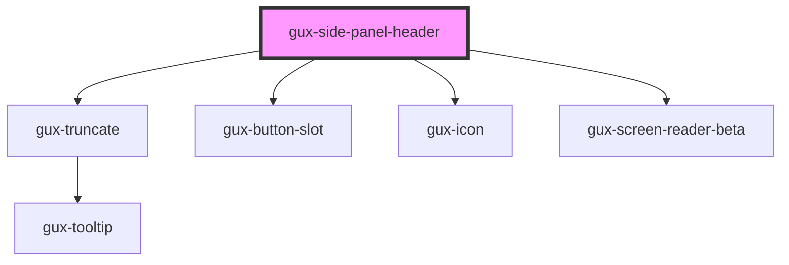

# gux-side-panel-header

<!-- Auto Generated Below -->

## Properties

| Property     | Attribute    | Description | Type      | Default |
| ------------ | ------------ | ----------- | --------- | ------- |
| `expandable` | `expandable` |             | `boolean` | `false` |

## Events

| Event          | Description | Type                |
| -------------- | ----------- | ------------------- |
| `guxcollapsed` |             | `CustomEvent<void>` |
| `guxexpanded`  |             | `CustomEvent<void>` |

## Slots

| Slot            | Description                                             |
| --------------- | ------------------------------------------------------- |
| `"badge"`       | Badge displayed on the right hand side                  |
| `"description"` | Description truncated to 3 lines                        |
| `"icon"`        | Icon component displayed on the left side of the header |
| `"title"`       | Title for the side panel                                |

## Dependencies

### Depends on

- [gux-truncate](../../../../stable/gux-truncate)
- [gux-button-slot](../../../../stable/gux-button-slot)
- [gux-icon](../../../../stable/gux-icon)
- [gux-screen-reader-beta](../../../gux-screen-reader)

### Graph

----------------------------------------------

*Built with [StencilJS](https://stenciljs.com/)*
