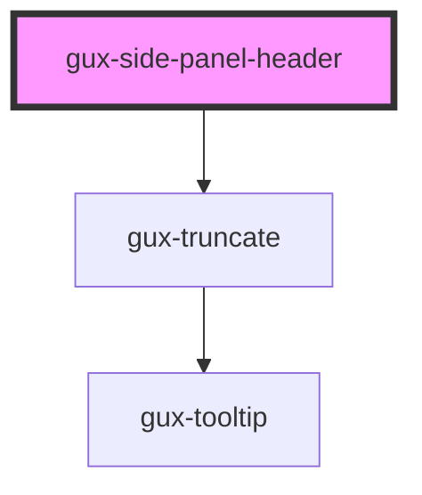

# gux-side-panel-header

<!-- Auto Generated Below -->

## Dependencies

### Depends on

- [gux-truncate](../../../../stable/gux-truncate)

### Graph

----------------------------------------------

*Built with [StencilJS](https://stenciljs.com/)*
