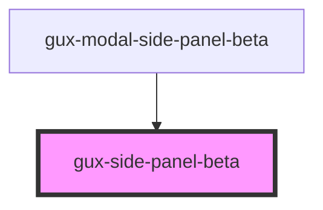

# gux-side-sheet-beta

<!-- Auto Generated Below -->

## Properties

| Property | Attribute | Description | Type                             | Default   |
| -------- | --------- | ----------- | -------------------------------- | --------- |
| `size`   | `size`    |             | `"large" \| "medium" \| "small"` | `'small'` |

## Slots

| Slot        | Description                   |
| ----------- | ----------------------------- |
| `"content"` | Required slot for the content |
| `"footer"`  | Optional slot for the footer  |
| `"header"`  | Required slot for the header  |
| `"tabs"`    | Optional slot for the tabs    |

## Dependencies

### Used by

 - [gux-modal-side-panel-beta](./components/gux-modal-side-panel)

### Graph

----------------------------------------------

*Built with [StencilJS](https://stenciljs.com/)*
