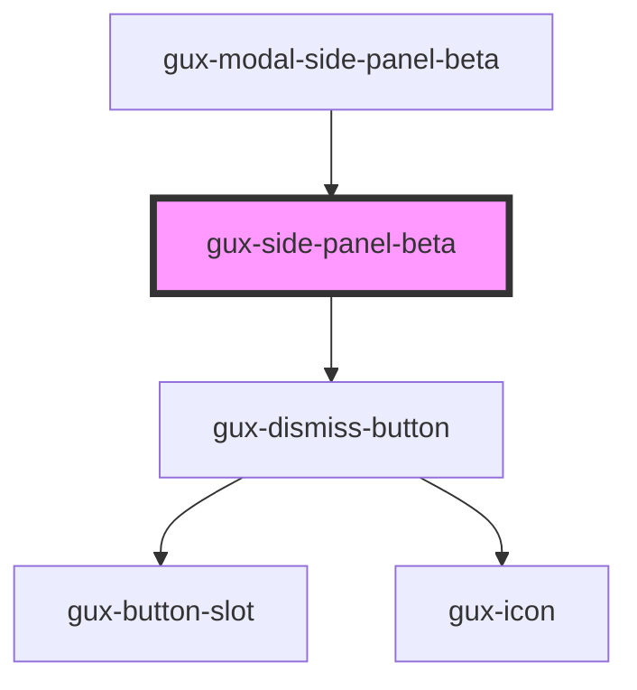

# gux-side-sheet-beta

<!-- Auto Generated Below -->

## Properties

| Property | Attribute | Description | Type                             | Default   |
| -------- | --------- | ----------- | -------------------------------- | --------- |
| `size`   | `size`    |             | `"large" \| "medium" \| "small"` | `'small'` |

## Events

| Event              | Description | Type                |
| ------------------ | ----------- | ------------------- |
| `sidePanelDismiss` |             | `CustomEvent<void>` |

## Slots

| Slot            | Description                       |
| --------------- | --------------------------------- |
| `"content"`     | Required slot for the content     |
| `"description"` | Optional slot for the description |
| `"footer"`      | Optional slot for the footer      |
| `"heading"`     | Required slot for the heading     |

## Dependencies

### Used by

 - [gux-modal-side-panel-beta](./components/gux-modal-side-panel)

### Depends on

- [gux-dismiss-button](../../stable/gux-dismiss-button)

### Graph

----------------------------------------------

*Built with [StencilJS](https://stenciljs.com/)*