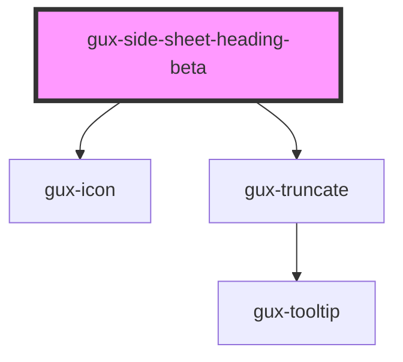

# gux-side-sheet-heading-beta

<!-- Auto Generated Below -->

## Properties

| Property | Attribute | Description         | Type                         | Default     |
| -------- | --------- | ------------------- | ---------------------------- | ----------- |
| `icon`   | `icon`    |                     | `string`                     | `undefined` |
| `level`  | `level`   | Heading level, 1-6. | `1 \| 2 \| 3 \| 4 \| 5 \| 6` | `1`         |
| `text`   | `text`    |                     | `string`                     | `undefined` |

## Dependencies

### Depends on

- [gux-icon](../../../stable/gux-icon)
- [gux-truncate](../../../stable/gux-truncate)

### Graph

----------------------------------------------

*Built with [StencilJS](https://stenciljs.com/)*
