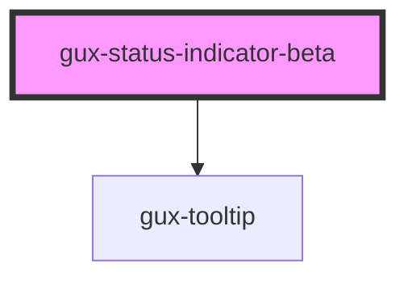

# gux-label-info-beta

<!-- Auto Generated Below -->

## Properties

| Property | Attribute | Description | Type                                          | Default  |
| -------- | --------- | ----------- | --------------------------------------------- | -------- |
| `accent` | `accent`  |             | `"error" \| "info" \| "success" \| "warning"` | `'info'` |

## Slots

| Slot             | Description                         |
| ---------------- | ----------------------------------- |
| `"default"`      | Slot for the status indicator text. |
| `"tooltip-text"` | Slot for the optional tooltip text  |

## Dependencies

### Depends on

- [gux-tooltip](../../stable/gux-tooltip)

### Graph

----------------------------------------------

*Built with [StencilJS](https://stenciljs.com/)*
