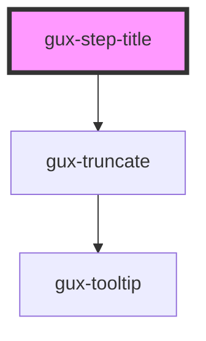

# gux-step-title

<!-- Auto Generated Below -->

## Events

| Event                      | Description | Type                  |
| -------------------------- | ----------- | --------------------- |
| `internalactivestepchange` |             | `CustomEvent<string>` |

## Slots

| Slot | Description   |
| ---- | ------------- |
|      | slot for text |

## Dependencies

### Depends on

- [gux-truncate](../../../../stable/gux-truncate)

### Graph

----------------------------------------------

*Built with [StencilJS](https://stenciljs.com/)*
