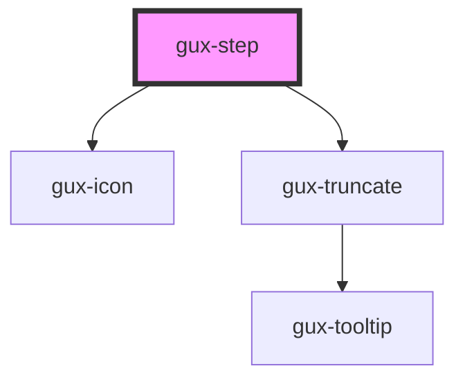

# gux-step

<!-- Auto Generated Below -->

## Properties

| Property   | Attribute  | Description          | Type                                     | Default        |
| ---------- | ---------- | -------------------- | ---------------------------------------- | -------------- |
| `disabled` | `disabled` |                      | `boolean`                                | `false`        |
| `status`   | `status`   |                      | `"completed" \| "error" \| "incomplete"` | `'incomplete'` |
| `stepId`   | `step-id`  | Step id for the step | `string`                                 | `undefined`    |

## Events

| Event                  | Description | Type                  |
| ---------------------- | ----------- | --------------------- |
| `internalactivatestep` |             | `CustomEvent<string>` |

## Methods

### `guxSetActive(active: boolean) => Promise<void>`

#### Parameters

| Name     | Type      | Description |
| -------- | --------- | ----------- |
| `active` | `boolean` |             |

#### Returns

Type: `Promise<void>`

## Slots

| Slot       | Description                      |
| ---------- | -------------------------------- |
| `"helper"` | Optional slot for help message.  |
| `"title"`  | Slot for gux-step-title element. |

## Dependencies

### Depends on

- [gux-icon](../../../stable/gux-icon)
- [gux-truncate](../../../stable/gux-truncate)

### Graph

----------------------------------------------

*Built with [StencilJS](https://stenciljs.com/)*
