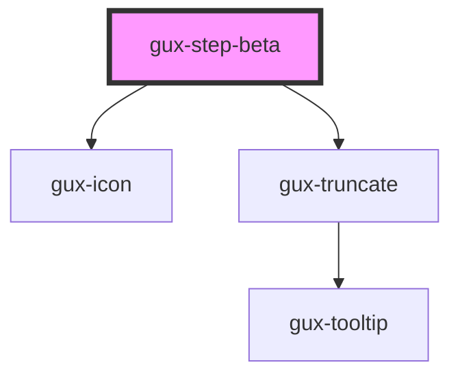

# gux-step-beta

<!-- Auto Generated Below -->

## Properties

| Property   | Attribute  | Description | Type                                                 | Default        |
| ---------- | ---------- | ----------- | ---------------------------------------------------- | -------------- |
| `disabled` | `disabled` |             | `boolean`                                            | `false`        |
| `status`   | `status`   |             | `"active" \| "completed" \| "error" \| "incomplete"` | `'incomplete'` |

## Slots

| Slot       | Description                     |
| ---------- | ------------------------------- |
| `"helper"` | Optional slot for help message. |
| `"title"`  | Slot for title.                 |

## Dependencies

### Depends on

- [gux-icon](../../../stable/gux-icon)
- [gux-truncate](../../../stable/gux-truncate)

### Graph

```mermaid
graph TD;
  gux-step-beta --> gux-icon
  gux-step-beta --> gux-truncate
  gux-truncate --> gux-tooltip
  style gux-step-beta fill:#f9f,stroke:#333,stroke-width:4px
```

----------------------------------------------

*Built with [StencilJS](https://stenciljs.com/)*
