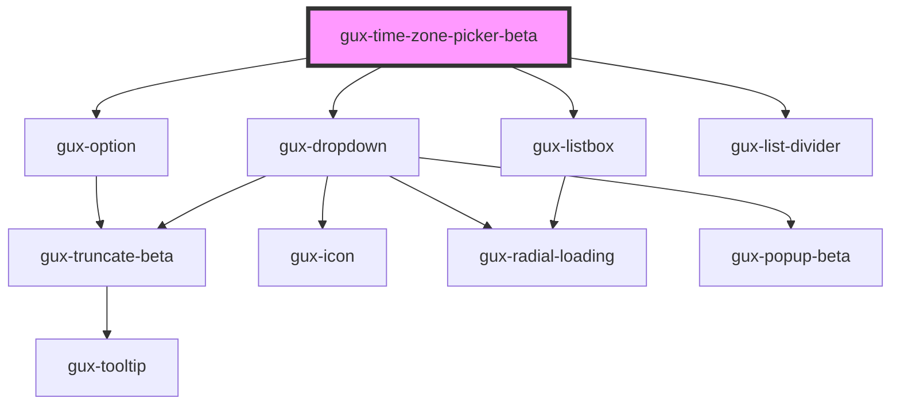

# gux-time-picker-beta

<!-- Auto Generated Below -->

## Properties

| Property           | Attribute           | Description | Type     | Default     |
| ------------------ | ------------------- | ----------- | -------- | ----------- |
| `localDefault`     | `local-default`     |             | `string` | `undefined` |
| `value`            | `value`             |             | `string` | `undefined` |
| `workspaceDefault` | `workspace-default` |             | `string` | `undefined` |

## Dependencies

### Depends on

- [gux-option](../../stable/gux-listbox/options/gux-option)
- [gux-dropdown](../../stable/gux-dropdown)
- [gux-listbox](../../stable/gux-listbox)
- [gux-list-divider](../../stable/gux-list/gux-list-divider)

### Graph

----------------------------------------------

*Built with [StencilJS](https://stenciljs.com/)*
