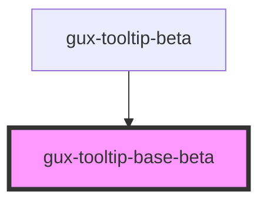

# gux-tooltip-base-beta

<!-- Auto Generated Below -->

## Properties

| Property     | Attribute    | Description                                         | Type                                                                                                                                                                 | Default          |
| ------------ | ------------ | --------------------------------------------------- | -------------------------------------------------------------------------------------------------------------------------------------------------------------------- | ---------------- |
| `accent`     | `accent`     |                                                     | `"dark" \| "light"`                                                                                                                                                  | `'light'`        |
| `forElement` | --           | Indicates the element the popover should anchor to. | `HTMLElement`                                                                                                                                                        | `undefined`      |
| `placement`  | `placement`  | Placement of the tooltip. Default is bottom-start   | `"bottom" \| "bottom-end" \| "bottom-start" \| "left" \| "left-end" \| "left-start" \| "right" \| "right-end" \| "right-start" \| "top" \| "top-end" \| "top-start"` | `'bottom-start'` |
| `tooltipId`  | `tooltip-id` |                                                     | `string`                                                                                                                                                             | `undefined`      |

## Methods

### `hideTooltip() => Promise<void>`

#### Returns

Type: `Promise<void>`

### `showTooltip() => Promise<void>`

#### Returns

Type: `Promise<void>`

## Slots

| Slot | Description            |
| ---- | ---------------------- |
|      | Content of the tooltip |

## Dependencies

### Used by

 - [gux-tooltip-beta](../gux-tooltip-beta)

### Graph

----------------------------------------------

*Built with [StencilJS](https://stenciljs.com/)*
