# gux-tooltip

This custom component is a simple tooltip.

When hovering a node, the tooltip will be shown below.

If there is not enough space on the bottom, or right of the component, the tooltip position will be adjusted.

## Example usage

``` html
<!-- First option (With parentElement) -->
<div>
  <button>Button</button>
  <gux-tooltip>My great tooltip</gux-tooltip>
</div>

<!-- Second option (With parent id in for attribute) -->
<button id="needs-tooltip">Button</button>
<gux-tooltip for="needs-tooltip">My great tooltip</gux-tooltip>
```

<!-- Auto Generated Below -->


## Properties

| Property     | Attribute     | Description                                                                                                                                  | Type                                                                                                                                                                 | Default          |
| ------------ | ------------- | -------------------------------------------------------------------------------------------------------------------------------------------- | -------------------------------------------------------------------------------------------------------------------------------------------------------------------- | ---------------- |
| `accent`     | `accent`      |                                                                                                                                              | `"dark" \| "light"`                                                                                                                                                  | `'light'`        |
| `for`        | `for`         | Indicates the id of the element the popover should anchor to. (If not supplied the parent element is used)                                   | `string`                                                                                                                                                             | `undefined`      |
| `placement`  | `placement`   | Placement of the tooltip. Default is bottom-start                                                                                            | `"bottom" \| "bottom-end" \| "bottom-start" \| "left" \| "left-end" \| "left-start" \| "right" \| "right-end" \| "right-start" \| "top" \| "top-end" \| "top-start"` | `'bottom-start'` |
| `visualOnly` | `visual-only` | Determines whether the text in the tooltip is read by screenreaders. Use for cases where the forElement component handles the accessibility. | `boolean`                                                                                                                                                            | `false`          |


## Methods

### `hideTooltip() => Promise<void>`


#### Returns

Type: `Promise<void>`


### `showTooltip() => Promise<void>`


#### Returns

Type: `Promise<void>`


## Slots

| Slot        | Description      |
| ----------- | ---------------- |
| `"content"` | Slot for content |


## Dependencies

### Used by

 - [gux-avatar-beta](../gux-avatar)
 - [gux-avatar-change-photo-beta](../gux-avatar/gux-avatar-change-photo)
 - [gux-avatar-group-add-item-beta](../gux-avatar-group/gux-avatar-group-add-item)
 - [gux-avatar-group-item-beta](../gux-avatar-group/gux-avatar-group-item)
 - [gux-button](../../stable/gux-button)
 - [gux-form-field-input-clear-button](../../stable/gux-form-field/helper-components/gux-form-field-input-clear-button)
 - [gux-icon-tooltip-beta](../gux-icon-tooltip)
 - [gux-label-info-beta](../gux-label-info)
 - [gux-rich-highlight-list-item](../gux-rich-text-editor/gux-rich-text-editor-list/gux-rich-highlight-list-item)
 - [gux-rich-text-editor-action](../gux-rich-text-editor/gux-rich-text-editor-action)
 - [gux-rich-text-editor-action-link](../gux-rich-text-editor/gux-rich-text-editor-action/gux-rich-text-editor-action-link)
 - [gux-rich-text-editor-action-rich-style](../gux-rich-text-editor/gux-rich-text-editor-action/gux-rich-text-editor-action-rich-style)
 - [gux-rich-text-editor-action-text-highlight](../gux-rich-text-editor/gux-rich-text-editor-action/gux-rich-text-editor-action-text-highlight)
 - [gux-rich-text-editor-menu](../gux-rich-text-editor/gux-rich-text-editor-menu)
 - [gux-table-toolbar-menu-button](../../stable/gux-table-toolbar/gux-table-toolbar-menu-button)

### Depends on

- [gux-tooltip-base-beta](../gux-tooltip-base)

### Graph

```mermaid
graph TD;
  gux-tooltip-beta --> gux-tooltip-base-beta
  gux-avatar-beta --> gux-tooltip-beta
  gux-avatar-change-photo-beta --> gux-tooltip-beta
  gux-avatar-group-add-item-beta --> gux-tooltip-beta
  gux-avatar-group-item-beta --> gux-tooltip-beta
  gux-button --> gux-tooltip-beta
  gux-form-field-input-clear-button --> gux-tooltip-beta
  gux-icon-tooltip-beta --> gux-tooltip-beta
  gux-label-info-beta --> gux-tooltip-beta
  gux-rich-highlight-list-item --> gux-tooltip-beta
  gux-rich-text-editor-action --> gux-tooltip-beta
  gux-rich-text-editor-action-link --> gux-tooltip-beta
  gux-rich-text-editor-action-rich-style --> gux-tooltip-beta
  gux-rich-text-editor-action-text-highlight --> gux-tooltip-beta
  gux-rich-text-editor-menu --> gux-tooltip-beta
  gux-table-toolbar-menu-button --> gux-tooltip-beta
  style gux-tooltip-beta fill:#f9f,stroke:#333,stroke-width:4px
```


----------------------------------------------

*Built with [StencilJS](https://stenciljs.com/)*
