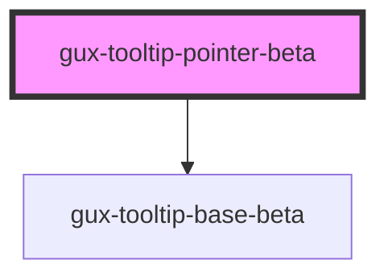

# gux-tooltip-pointer-beta

<!-- Auto Generated Below -->

## Properties

| Property     | Attribute     | Description                                                                                                                                  | Type                                                                                                                                                                 | Default     |
| ------------ | ------------- | -------------------------------------------------------------------------------------------------------------------------------------------- | -------------------------------------------------------------------------------------------------------------------------------------------------------------------- | ----------- |
| `accent`     | `accent`      |                                                                                                                                              | `"dark" \| "light"`                                                                                                                                                  | `'light'`   |
| `for`        | `for`         | Indicates the id of the element the popover should anchor to. (If not supplied the parent element is used)                                   | `string`                                                                                                                                                             | `undefined` |
| `placement`  | `placement`   |                                                                                                                                              | `"bottom" \| "bottom-end" \| "bottom-start" \| "left" \| "left-end" \| "left-start" \| "right" \| "right-end" \| "right-start" \| "top" \| "top-end" \| "top-start"` | `undefined` |
| `visualOnly` | `visual-only` | Determines whether the text in the tooltip is read by screenreaders. Use for cases where the forElement component handles the accessibility. | `boolean`                                                                                                                                                            | `false`     |

## Methods

### `hideTooltip() => Promise<void>`

#### Returns

Type: `Promise<void>`

### `showTooltip() => Promise<void>`

#### Returns

Type: `Promise<void>`

## Slots

| Slot        | Description      |
| ----------- | ---------------- |
| `"content"` | Slot for content |

## Dependencies

### Depends on

- [gux-tooltip-base-beta](../gux-tooltip-base)

### Graph

----------------------------------------------

*Built with [StencilJS](https://stenciljs.com/)*
