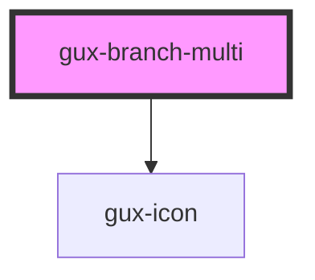

# gux-branch-multi

<!-- Auto Generated Below -->

## Properties

| Property        | Attribute       | Description | Type      | Default     |
| --------------- | --------------- | ----------- | --------- | ----------- |
| `active`        | `active`        |             | `boolean` | `false`     |
| `disabled`      | `disabled`      |             | `boolean` | `false`     |
| `expanded`      | `expanded`      |             | `boolean` | `false`     |
| `filtered`      | `filtered`      |             | `boolean` | `false`     |
| `indeterminate` | `indeterminate` |             | `boolean` | `false`     |
| `selected`      | `selected`      |             | `boolean` | `false`     |
| `value`         | `value`         |             | `string`  | `undefined` |

## Slots

| Slot      | Description                       |
| --------- | --------------------------------- |
| `"icon"`  | Optional slot for the icon        |
| `"label"` | Required slot for the branch text |

## Dependencies

### Depends on

- [gux-icon](../../../stable/gux-icon)

### Graph

----------------------------------------------

*Built with [StencilJS](https://stenciljs.com/)*
