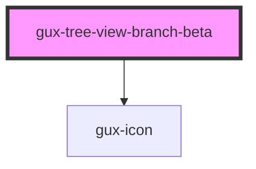

# gux-tree-view-branch

<!-- Auto Generated Below -->

## Properties

| Property      | Attribute     | Description | Type                   | Default   |
| ------------- | ------------- | ----------- | ---------------------- | --------- |
| `disabled`    | `disabled`    |             | `boolean`              | `false`   |
| `layout`      | `layout`      |             | `"comfy" \| "compact"` | `'comfy'` |
| `multiselect` | `multiselect` |             | `boolean`              | `false`   |
| `open`        | `open`        |             | `boolean`              | `false`   |
| `selected`    | `selected`    |             | `boolean`              | `false`   |

## Events

| Event           | Description | Type                  |
| --------------- | ----------- | --------------------- |
| `guxselected`   |             | `CustomEvent<string>` |
| `guxunselected` |             | `CustomEvent<string>` |

## Slots

| Slot             | Description                       |
| ---------------- | --------------------------------- |
| `"branch-icon"`  | Optional slot for the icon        |
| `"branch-label"` | Required slot for the branch text |

## Dependencies

### Depends on

- [gux-icon](../../../stable/gux-icon)

### Graph

----------------------------------------------

*Built with [StencilJS](https://stenciljs.com/)*
