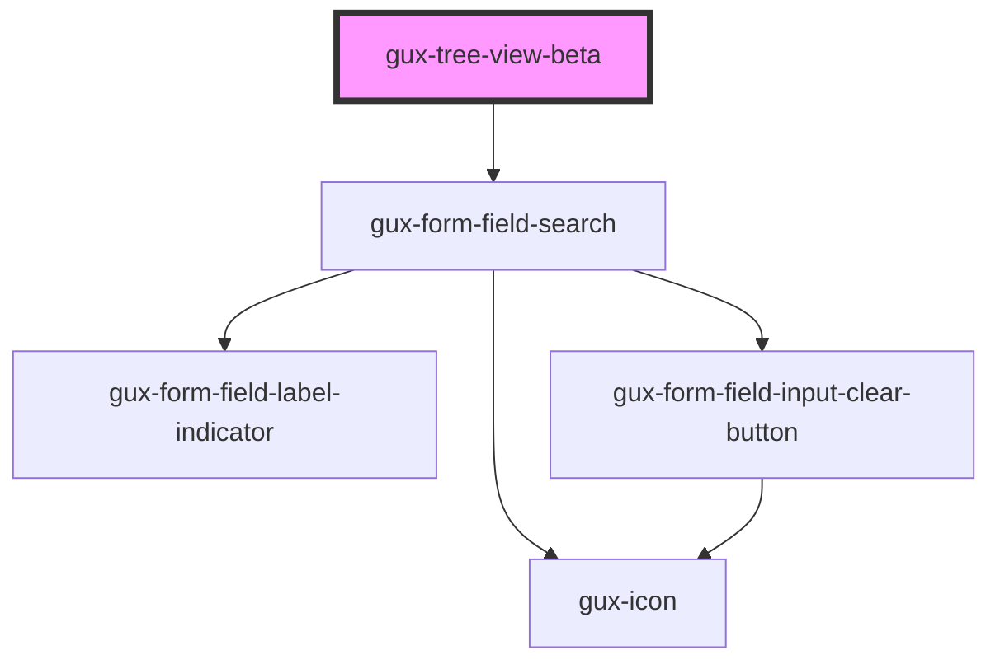

# gux-tree-view

<!-- Auto Generated Below -->

## Properties

| Property      | Attribute     | Description | Type                   | Default     |
| ------------- | ------------- | ----------- | ---------------------- | ----------- |
| `layout`      | `layout`      |             | `"comfy" \| "compact"` | `'comfy'`   |
| `multiselect` | `multiselect` |             | `boolean`              | `false`     |
| `searchable`  | `searchable`  |             | `boolean`              | `false`     |
| `value`       | `value`       |             | `string`               | `undefined` |

## Slots

| Slot           | Description                                         |
| -------------- | --------------------------------------------------- |
| `"default"`    | gux-tree-view-branch or gux-tree-view-leaf elements |
| `"tree-label"` | label for the tree                                  |

## Dependencies

### Depends on

- [gux-form-field-search](../../stable/gux-form-field/components/gux-form-field-search)

### Graph

----------------------------------------------

*Built with [StencilJS](https://stenciljs.com/)*
