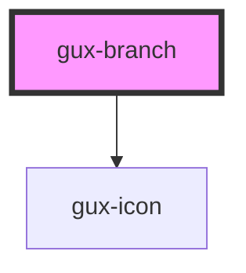

# gux-branch

<!-- Auto Generated Below -->

## Properties

| Property   | Attribute  | Description | Type      | Default     |
| ---------- | ---------- | ----------- | --------- | ----------- |
| `expanded` | `expanded` |             | `boolean` | `false`     |
| `value`    | `value`    |             | `string`  | `undefined` |

## Slots

| Slot      | Description                       |
| --------- | --------------------------------- |
| `"icon"`  | Optional slot for the icon        |
| `"label"` | Required slot for the branch text |

## Dependencies

### Depends on

- [gux-icon](../../../stable/gux-icon)

### Graph

----------------------------------------------

*Built with [StencilJS](https://stenciljs.com/)*
