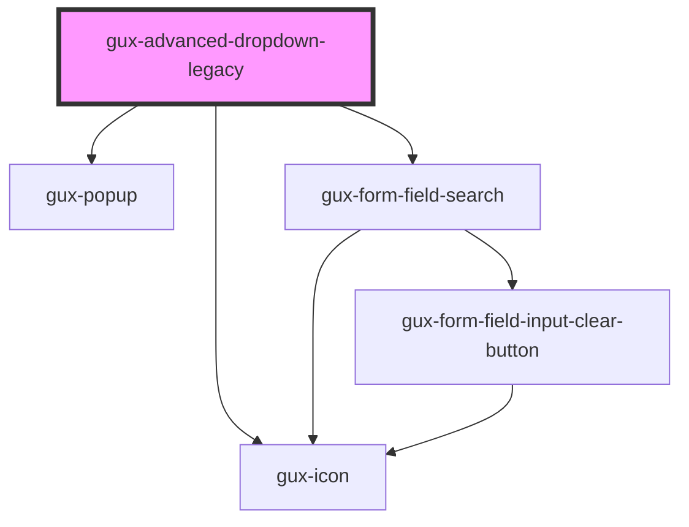

# gux-advanced-dropdown-legacy

Lorem ipsum dolor sit amet, consectetur adipiscing elit, sed do eiusmod tempor incididunt ut labore et dolore magna aliqua. Ut enim ad minim veniam, quis nostrud exercitation ullamco laboris nisi ut aliquip ex ea commodo consequat. Duis aute irure dolor in reprehenderit in voluptate velit esse cillum dolore eu fugiat nulla pariatur. Excepteur sint occaecat cupidatat non proident, sunt in culpa qui officia deserunt mollit anim id est laborum.

<!-- Auto Generated Below -->

## Properties

| Property                | Attribute                 | Description                                                                                                                | Type      | Default     |
| ----------------------- | ------------------------- | -------------------------------------------------------------------------------------------------------------------------- | --------- | ----------- |
| `disabled`              | `disabled`                | Disable the input and prevent interactions.                                                                                | `boolean` | `false`     |
| `dropdownHeight`        | `dropdown-height`         | CSS string used to set the maximum height of the dropdown option container. Default is set to 10 options as defined by UX. | `string`  | `'320px'`   |
| `filterDebounceTimeout` | `filter-debounce-timeout` | Timeout between filter input changed and event being emitted.                                                              | `number`  | `500`       |
| `noFilter`              | `no-filter`               | Whether the list should filter its current options.                                                                        | `boolean` | `false`     |
| `placeholder`           | `placeholder`             | The dropdown's placeholder.                                                                                                | `string`  | `undefined` |

## Events

| Event    | Description                                             | Type                  |
| -------- | ------------------------------------------------------- | --------------------- |
| `filter` | Fires when the filter of the advanced dropdown changes. | `CustomEvent<string>` |
| `input`  | Fires when the value of the advanced dropdown changes.  | `CustomEvent<string>` |

## Methods

### `getSelectedValues() => Promise<string[]>`

Gets the currently selected values.

#### Returns

Type: `Promise<string[]>`

The array of selected values.

### `setLabeledBy(id: string) => Promise<void>`

#### Parameters

| Name | Type     | Description |
| ---- | -------- | ----------- |
| `id` | `string` |             |

#### Returns

Type: `Promise<void>`

## Slots

| Slot | Description                                |
| ---- | ------------------------------------------ |
|      | collection of gux-dropdown-option elements |

## Dependencies

### Depends on

- [gux-popup](../../stable/gux-popup)
- [gux-icon](../../stable/gux-icon)
- [gux-form-field-search](../../stable/gux-form-field/components/gux-form-field-search)

### Graph

----------------------------------------------

*Built with [StencilJS](https://stenciljs.com/)*
