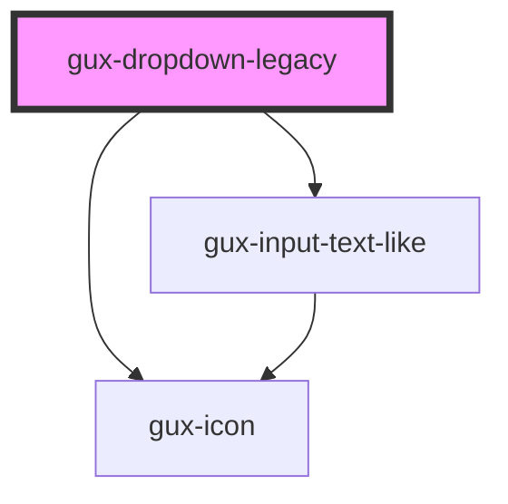

# gux-dropdown-legacy

<!-- Auto Generated Below -->

## Properties

| Property      | Attribute     | Description                                      | Type                               | Default     |
| ------------- | ------------- | ------------------------------------------------ | ---------------------------------- | ----------- |
| `disabled`    | `disabled`    | Disable the input and prevent interactions.      | `boolean`                          | `false`     |
| `filterable`  | `filterable`  | Whether the user can filter or not.              | `boolean`                          | `undefined` |
| `mode`        | `mode`        | Sets the select mode (default, page or palette). | `"default" \| "page" \| "palette"` | `'default'` |
| `placeholder` | `placeholder` | The dropdown placeholder.                        | `string`                           | `undefined` |
| `value`       | `value`       | Indicate the dropdown input value                | `string`                           | `''`        |

## Events

| Event    | Description                      | Type                  |
| -------- | -------------------------------- | --------------------- |
| `change` | Emits when selection is changed. | `CustomEvent<string>` |

## Methods

### `setLabeledBy(id: string) => Promise<void>`

#### Returns

Type: `Promise<void>`

### `setSelected() => Promise<void>`

#### Returns

Type: `Promise<void>`

## Dependencies

### Depends on

- [gux-input-text-like](../gux-form-field-legacy/components/gux-input-text-like)
- [gux-icon](../../stable/gux-icon)

### Graph

----------------------------------------------

*Built with [StencilJS](https://stenciljs.com/)*
