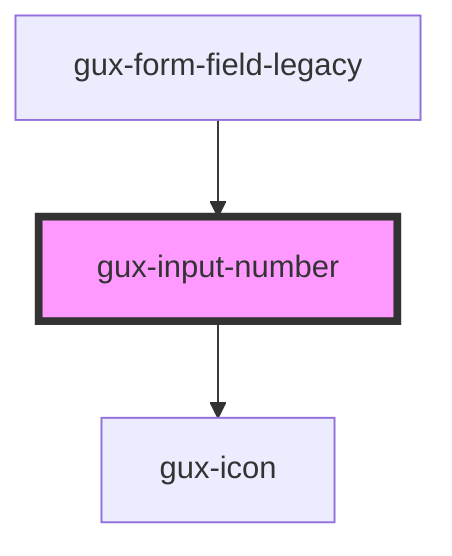

# gux-input-number

<!-- Auto Generated Below -->

## Properties

| Property    | Attribute   | Description | Type      | Default     |
| ----------- | ----------- | ----------- | --------- | ----------- |
| `clearable` | `clearable` |             | `boolean` | `undefined` |

## Slots

| Slot      | Description                           |
| --------- | ------------------------------------- |
| `"input"` | Required slot for input[type="radio"] |

## Dependencies

### Used by

 - [gux-form-field-legacy](../..)

### Depends on

- [gux-icon](../../../../stable/gux-icon)

### Graph

----------------------------------------------

*Built with [StencilJS](https://stenciljs.com/)*
