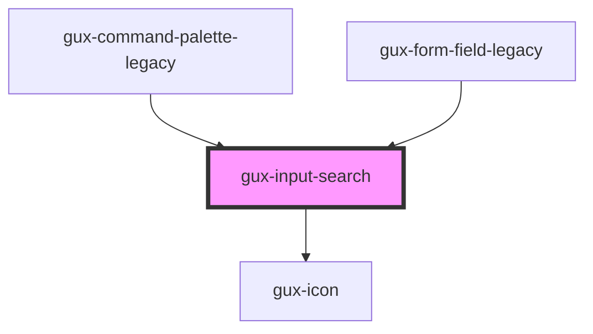

# gux-search-input

<!-- Auto Generated Below -->

## Slots

| Slot        | Description                   |
| ----------- | ----------------------------- |
| `"default"` | slot for input[type="search"] |

## Dependencies

### Used by

 - [gux-command-palette-legacy](../../../gux-command-palette-legacy)
 - [gux-form-field-legacy](../..)

### Depends on

- [gux-icon](../../../../stable/gux-icon)

### Graph

----------------------------------------------

*Built with [StencilJS](https://stenciljs.com/)*
