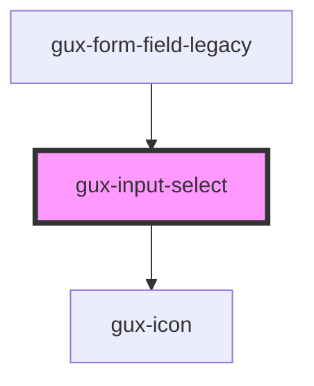

# gux-input-select

<!-- Auto Generated Below -->

## Slots

| Slot      | Description                      |
| --------- | -------------------------------- |
| `"input"` | Required slot for select element |

## Dependencies

### Used by

 - [gux-form-field-legacy](../..)

### Depends on

- [gux-icon](../../../../stable/gux-icon)

### Graph

----------------------------------------------

*Built with [StencilJS](https://stenciljs.com/)*
