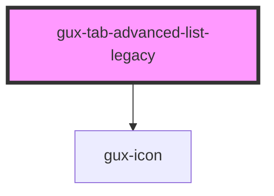

# gux-tab-advanced-list-legacy

<!-- Auto Generated Below -->

## Properties

| Property           | Attribute             | Description                     | Type      | Default    |
| ------------------ | --------------------- | ------------------------------- | --------- | ---------- |
| `allowSort`        | `allow-sort`          | Enable tab sorting by drag/drop | `boolean` | `true`     |
| `showNewTabButton` | `show-new-tab-button` | Enable new tab button           | `boolean` | `true`     |
| `tabLimit`         | `tab-limit`           | Maximum number of tabs created  | `number`  | `Infinity` |

## Events

| Event         | Description                                       | Type                    |
| ------------- | ------------------------------------------------- | ----------------------- |
| `newTab`      | Triggers when the new tab button is selected.     | `CustomEvent<any>`      |
| `sortChanged` | Triggers when the sorting of the tabs is changed. | `CustomEvent<string[]>` |

## Methods

### `guxSetActive(activeTab: string) => Promise<void>`

#### Returns

Type: `Promise<void>`

## Dependencies

### Depends on

- [gux-icon](../../../stable/gux-icon)

### Graph

----------------------------------------------

*Built with [StencilJS](https://stenciljs.com/)*
