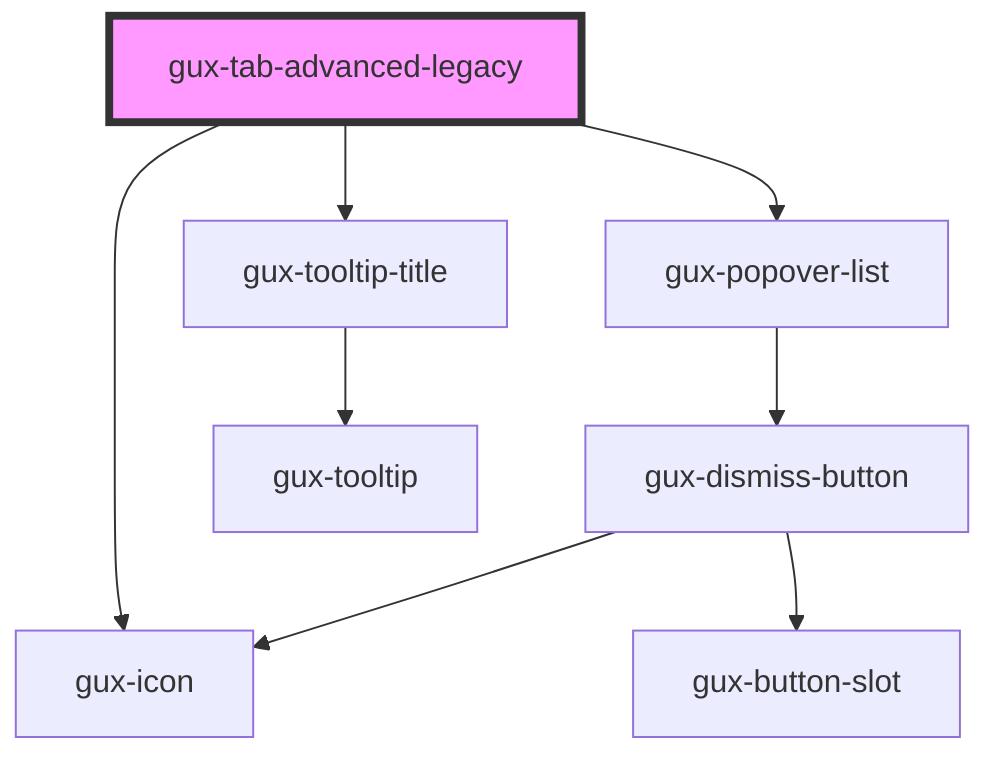

# gux-tab-advanced-legacy

<!-- Auto Generated Below -->

## Properties

| Property      | Attribute      | Description           | Type      | Default     |
| ------------- | -------------- | --------------------- | --------- | ----------- |
| `guxDisabled` | `gux-disabled` |                       | `boolean` | `false`     |
| `tabId`       | `tab-id`       | unique id for the tab | `string`  | `undefined` |

## Events

| Event                      | Description | Type                  |
| -------------------------- | ----------- | --------------------- |
| `internalactivatetabpanel` |             | `CustomEvent<string>` |

## Methods

### `guxFocus() => Promise<void>`

#### Returns

Type: `Promise<void>`

### `guxGetActive() => Promise<boolean>`

#### Returns

Type: `Promise<boolean>`

### `guxSetActive(active: boolean) => Promise<void>`

#### Returns

Type: `Promise<void>`

## Slots

| Slot                 | Description                                                                             |
| -------------------- | --------------------------------------------------------------------------------------- |
| `"default"`          | gux-icon (optional) and text node (required)                                            |
| `"dropdown-options"` | optional slot for tab options, must slot a gux-list element with gux-list-item children |

## Dependencies

### Depends on

- [gux-icon](../../../stable/gux-icon)
- [gux-popover-list](../../../stable/gux-popover-list)
- [gux-tooltip-title](../../../stable/gux-tooltip-title)

### Graph

----------------------------------------------

*Built with [StencilJS](https://stenciljs.com/)*
