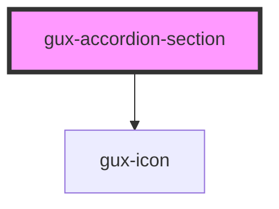

# gux-accordion

<!-- Auto Generated Below -->

## Properties

| Property          | Attribute          | Description                                                                                                                             | Type                                          | Default     |
| ----------------- | ------------------ | --------------------------------------------------------------------------------------------------------------------------------------- | --------------------------------------------- | ----------- |
| `arrowPosition`   | `arrow-position`   | Position of the arrow chevron icon. Position can be 'default' or 'before-text'.  'beside-text' is deprecated and will be removed in v4. | `"before-text" \| "beside-text" \| "default"` | `'default'` |
| `contentLayout`   | `content-layout`   | The content layout used in the accordion section. 'text' layout provides default padding, 'custom' removes default padding.             | `"custom" \| "text"`                          | `'text'`    |
| `disabled`        | `disabled`         |                                                                                                                                         | `boolean`                                     | `false`     |
| `open`            | `open`             |                                                                                                                                         | `boolean`                                     | `false`     |
| `reverseHeadings` | `reverse-headings` |                                                                                                                                         | `boolean`                                     | `false`     |

## Events

| Event       | Description | Type                |
| ----------- | ----------- | ------------------- |
| `guxclosed` |             | `CustomEvent<void>` |
| `guxopened` |             | `CustomEvent<void>` |

## Slots

| Slot          | Description                     |
| ------------- | ------------------------------- |
| `"header"`    | Required slot for the heading   |
| `"icon"`      | Optional slot for an icon       |
| `"subheader"` | Optional slot for a subheader * |

## Dependencies

### Depends on

- [gux-icon](../../gux-icon)

### Graph

----------------------------------------------

*Built with [StencilJS](https://stenciljs.com/)*
