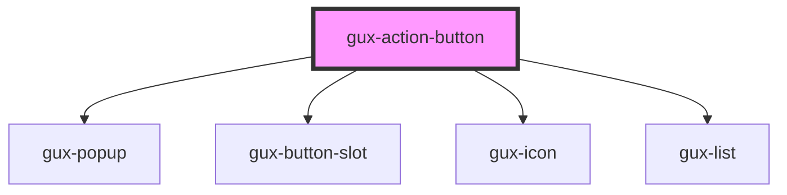

# gux-action-button

<!-- Auto Generated Below -->

## Properties

| Property   | Attribute  | Description                         | Type                                                 | Default       |
| ---------- | ---------- | ----------------------------------- | ---------------------------------------------------- | ------------- |
| `accent`   | `accent`   |                                     | `"danger" \| "primary" \| "secondary" \| "tertiary"` | `'secondary'` |
| `disabled` | `disabled` | Disables the action button.         | `boolean`                                            | `false`       |
| `isOpen`   | `is-open`  | It is used to open or not the list. | `boolean`                                            | `false`       |
| `type`     | `type`     | The component button type           | `"button" \| "reset" \| "submit"`                    | `'button'`    |

## Events

| Event         | Description                                 | Type               |
| ------------- | ------------------------------------------- | ------------------ |
| `actionClick` | Triggered when the action button is clicked | `CustomEvent<any>` |
| `close`       | Triggered when the menu is close            | `CustomEvent<any>` |
| `open`        | Triggered when the menu is open             | `CustomEvent<any>` |

## Slots

| Slot      | Description                   |
| --------- | ----------------------------- |
| `"title"` | slot for icon and button text |

## Dependencies

### Depends on

- [gux-popup](../gux-popup)
- [gux-button-slot](../gux-button-slot)
- [gux-icon](../gux-icon)
- [gux-list](../gux-list)

### Graph

----------------------------------------------

*Built with [StencilJS](https://stenciljs.com/)*
