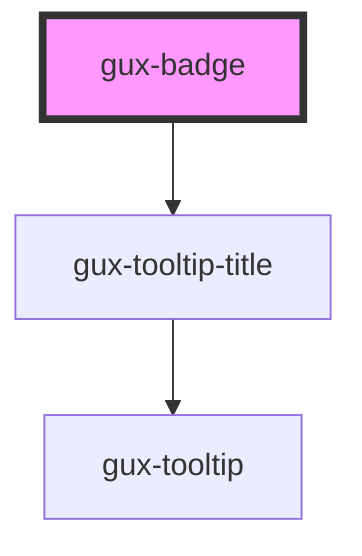

# gux-badge

<!-- Auto Generated Below -->

## Properties

| Property | Attribute | Description | Type                                                       | Default  |
| -------- | --------- | ----------- | ---------------------------------------------------------- | -------- |
| `accent` | `accent`  |             | `"error" \| "info" \| "inherit" \| "success" \| "warning"` | `'info'` |
| `bold`   | `bold`    |             | `boolean`                                                  | `false`  |

## Slots

| Slot | Description             |
| ---- | ----------------------- |
|      | Required slot for label |

## CSS Custom Properties

| Name                                             | Description |
| ------------------------------------------------ | ----------- |
| `--gse-ui-badge-borderRadius`                    |             |
| `--gse-ui-badge-error-bold-backgroundColor`      |             |
| `--gse-ui-badge-error-bold-foregroundColor`      |             |
| `--gse-ui-badge-error-regular-backgroundColor`   |             |
| `--gse-ui-badge-error-regular-foregroundColor`   |             |
| `--gse-ui-badge-gap`                             |             |
| `--gse-ui-badge-height`                          |             |
| `--gse-ui-badge-info-bold-backgroundColor`       |             |
| `--gse-ui-badge-info-bold-foregroundColor`       |             |
| `--gse-ui-badge-info-regular-backgroundColor`    |             |
| `--gse-ui-badge-info-regular-foregroundColor`    |             |
| `--gse-ui-badge-success-bold-backgroundColor`    |             |
| `--gse-ui-badge-success-bold-foregroundColor`    |             |
| `--gse-ui-badge-success-regular-backgroundColor` |             |
| `--gse-ui-badge-success-regular-foregroundColor` |             |
| `--gse-ui-badge-text-fontFamily`                 |             |
| `--gse-ui-badge-text-fontSize`                   |             |
| `--gse-ui-badge-text-fontWeight // missing`      |             |
| `--gse-ui-badge-text-lineHeight`                 |             |
| `--gse-ui-badge-warning-bold-backgroundColor`    |             |
| `--gse-ui-badge-warning-bold-foregroundColor`    |             |
| `--gse-ui-badge-warning-regular-backgroundColor` |             |
| `--gse-ui-badge-warning-regular-foregroundColor` |             |

## Dependencies

### Depends on

- [gux-tooltip-title](../gux-tooltip-title)

### Graph

----------------------------------------------

*Built with [StencilJS](https://stenciljs.com/)*
