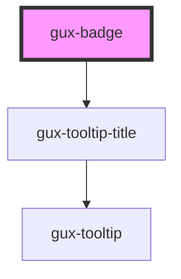

# gux-badge

<!-- Auto Generated Below -->

## Properties

| Property | Attribute | Description | Type                                                       | Default  |
| -------- | --------- | ----------- | ---------------------------------------------------------- | -------- |
| `accent` | `accent`  |             | `"error" \| "info" \| "inherit" \| "success" \| "warning"` | `'info'` |
| `bold`   | `bold`    |             | `boolean`                                                  | `false`  |

## Slots

| Slot | Description             |
| ---- | ----------------------- |
|      | Required slot for label |

## Dependencies

### Depends on

- [gux-tooltip-title](../gux-tooltip-title)

### Graph

----------------------------------------------

*Built with [StencilJS](https://stenciljs.com/)*
