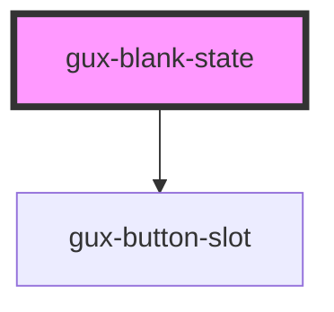

# gux-blank-state

<!-- Auto Generated Below -->

## Slots

| Slot                    | Description                                 |
| ----------------------- | ------------------------------------------- |
| `"additional-guidance"` | Slot for additional-guidance.               |
| `"call-to-action"`      | Slot for the message call to action button. |
| `"image"`               | Slot for gux-icon element.                  |
| `"primary-message"`     | Required slot for primary-message.          |

## CSS Custom Properties

| Name                                                                | Description |
| ------------------------------------------------------------------- | ----------- |
| `--gse-ui-badge-height`                                             |             |
| `--gse-ui-blankState-backgroundColor`                               |             |
| `--gse-ui-blankState-borderRadius`                                  |             |
| `--gse-ui-blankState-gapContent`                                    |             |
| `--gse-ui-blankState-gapMain`                                       |             |
| `--gse-ui-blankState-gapMessage`                                    |             |
| `--gse-ui-blankState-icon-size-lg`                                  |             |
| `--gse-ui-blankState-icon-size-sm`                                  |             |
| `--gse-ui-blankState-iconColor`                                     |             |
| `--gse-ui-blankState-large-minWidth`                                |             |
| `--gse-ui-blankState-padding`                                       |             |
| `--gse-ui-progressAndLoading-blankState-large-header-fontFamily`    |             |
| `--gse-ui-progressAndLoading-blankState-large-header-fontSize`      |             |
| `--gse-ui-progressAndLoading-blankState-large-header-fontWeight`    |             |
| `--gse-ui-progressAndLoading-blankState-large-header-lineHeight`    |             |
| `--gse-ui-progressAndLoading-blankState-large-subheader-fontFamily` |             |
| `--gse-ui-progressAndLoading-blankState-large-subheader-fontSize`   |             |
| `--gse-ui-progressAndLoading-blankState-large-subheader-fontWeight` |             |
| `--gse-ui-progressAndLoading-blankState-large-subheader-lineHeight` |             |
| `--gse-ui-progressAndLoading-blankState-small-header-fontFamily`    |             |
| `--gse-ui-progressAndLoading-blankState-small-header-fontSize`      |             |
| `--gse-ui-progressAndLoading-blankState-small-header-fontWeight`    |             |
| `--gse-ui-progressAndLoading-blankState-small-header-lineHeight`    |             |
| `--gse-ui-progressAndLoading-blankState-small-subheader-fontFamily` |             |
| `--gse-ui-progressAndLoading-blankState-small-subheader-fontSize`   |             |
| `--gse-ui-progressAndLoading-blankState-small-subheader-fontWeight` |             |
| `--gse-ui-progressAndLoading-blankState-small-subheader-lineHeight` |             |

## Dependencies

### Depends on

- [gux-button-slot](../gux-button-slot)

### Graph

----------------------------------------------

*Built with [StencilJS](https://stenciljs.com/)*
