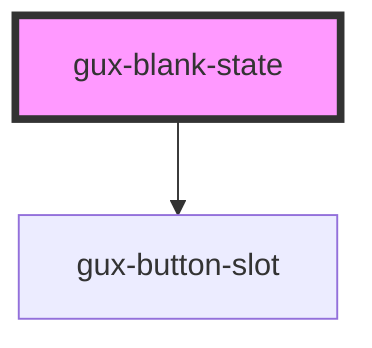

# gux-blank-state

<!-- Auto Generated Below -->

## Slots

| Slot                    | Description                                 |
| ----------------------- | ------------------------------------------- |
| `"additional-guidance"` | Slot for additional-guidance.               |
| `"call-to-action"`      | Slot for the message call to action button. |
| `"image"`               | Slot for gux-icon element.                  |
| `"primary-message"`     | Required slot for primary-message.          |

## Dependencies

### Depends on

- [gux-button-slot](../gux-button-slot)

### Graph

----------------------------------------------

*Built with [StencilJS](https://stenciljs.com/)*
