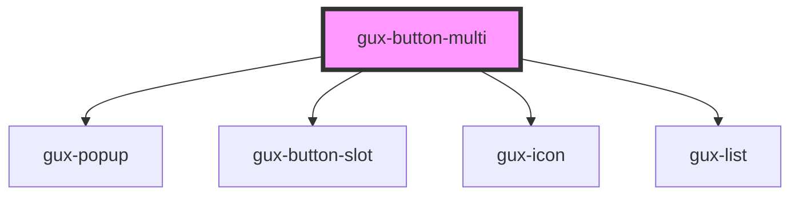

# gux-buttom-multi
An action button. In order to use this element toggle children must be slotted in.

Example usage
```html
  <gux-button-multi text="Primary" accent="primary" is-open="true">
    <gux-list-item onclick="notify(event)">Test 1</gux-list-item>
    <gux-list-item onclick="notify(event)">Test 2</gux-list-item>
    <gux-list-item onclick="notify(event)">Test 3</gux-list-item>
    <gux-list-divider></gux-list-divider>
    <gux-list-item onclick="notify(event)">Test 4</gux-list-item>
  </gux-button-multi>
```

<!-- Auto Generated Below -->


## Properties

| Property   | Attribute  | Description                         | Type                                     | Default       |
| ---------- | ---------- | ----------------------------------- | ---------------------------------------- | ------------- |
| `accent`   | `accent`   |                                     | `"primary" \| "secondary" \| "tertiary"` | `'secondary'` |
| `disabled` | `disabled` | Disables the action button.         | `boolean`                                | `false`       |
| `isOpen`   | `is-open`  | It is used to open or not the list. | `boolean`                                | `false`       |


## Events

| Event   | Description                      | Type               |
| ------- | -------------------------------- | ------------------ |
| `close` | Triggered when the menu is close | `CustomEvent<any>` |
| `open`  | Triggered when the menu is open  | `CustomEvent<any>` |


## Slots

| Slot      | Description                   |
| --------- | ----------------------------- |
| `"title"` | slot for icon and button text |


## Dependencies

### Depends on

- [gux-popup](../gux-popup)
- [gux-button-slot](../gux-button-slot)
- [gux-icon](../gux-icon)
- [gux-list](../gux-list)

### Graph


----------------------------------------------

*Built with [StencilJS](https://stenciljs.com/)*
