# gux-button-slot
<!-- Auto Generated Below -->

## Properties

| Property   | Attribute   | Description | Type                                                                        | Default       |
| ---------- | ----------- | ----------- | --------------------------------------------------------------------------- | ------------- |
| `accent`   | `accent`    |             | `"danger" \| "ghost" \| "inline" \| "primary" \| "secondary" \| "tertiary"` | `'secondary'` |
| `iconOnly` | `icon-only` |             | `boolean`                                                                   | `undefined`   |

## Slots

| Slot | Description                                                  |
| ---- | ------------------------------------------------------------ |
|      | button, input[type="button"] or input[type="submit"] element |

## Dependencies

### Used by

 - [gux-action-button](../gux-action-button)
 - [gux-blank-state](../gux-blank-state)
 - [gux-button-multi](../gux-button-multi)
 - [gux-context-menu](../gux-context-menu)
 - [gux-dismiss-button](../gux-dismiss-button)
 - [gux-pagination-buttons](../gux-pagination/gux-pagination-buttons)
 - [gux-pagination-buttons-legacy](../../legacy/gux-pagination-legacy/gux-pagination-buttons-legacy)
 - [gux-pagination-cursor](../gux-pagination-cursor)
 - [gux-rich-text-editor-action](../../beta/gux-rich-text-editor/gux-rich-text-editor-action)
 - [gux-rich-text-editor-action-rich-style](../../beta/gux-rich-text-editor/gux-rich-text-editor-action/gux-rich-text-editor-action-rich-style)
 - [gux-tab-advanced](../gux-tabs-advanced/gux-tab-advanced)
 - [gux-tab-advanced-list](../gux-tabs-advanced/gux-tab-advanced-list)
 - [gux-tab-list](../gux-tabs/gux-tab-list)
 - [gux-table-toolbar-custom-action](../gux-table-toolbar/gux-table-toolbar-custom-action)
 - [gux-table-toolbar-menu-button](../gux-table-toolbar/gux-table-toolbar-menu-button)
 - [gux-toast](../gux-toast)

### Graph

```mermaid
graph TD;
  gux-action-button --> gux-button-slot
  gux-blank-state --> gux-button-slot
  gux-button-multi --> gux-button-slot
  gux-context-menu --> gux-button-slot
  gux-dismiss-button --> gux-button-slot
  gux-pagination-buttons --> gux-button-slot
  gux-pagination-buttons-legacy --> gux-button-slot
  gux-pagination-cursor --> gux-button-slot
  gux-rich-text-editor-action --> gux-button-slot
  gux-rich-text-editor-action-rich-style --> gux-button-slot
  gux-tab-advanced --> gux-button-slot
  gux-tab-advanced-list --> gux-button-slot
  gux-tab-list --> gux-button-slot
  gux-table-toolbar-custom-action --> gux-button-slot
  gux-table-toolbar-menu-button --> gux-button-slot
  gux-toast --> gux-button-slot
  style gux-button-slot fill:#f9f,stroke:#333,stroke-width:4px
```

----------------------------------------------

*Built with [StencilJS](https://stenciljs.com/)*
