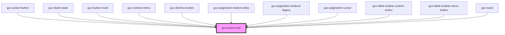

# gux-button-slot
<!-- Auto Generated Below -->

## Properties

| Property | Attribute | Description | Type                                                                        | Default       |
| -------- | --------- | ----------- | --------------------------------------------------------------------------- | ------------- |
| `accent` | `accent`  |             | `"danger" \| "ghost" \| "inline" \| "primary" \| "secondary" \| "tertiary"` | `'secondary'` |

## Slots

| Slot | Description                                                  |
| ---- | ------------------------------------------------------------ |
|      | button, input[type="button"] or input[type="submit"] element |

## Dependencies

### Used by

 - [gux-action-button](../gux-action-button)
 - [gux-blank-state](../gux-blank-state)
 - [gux-button-multi](../gux-button-multi)
 - [gux-context-menu](../../beta/gux-context-menu)
 - [gux-dismiss-button](../gux-dismiss-button)
 - [gux-pagination-buttons-beta](../../beta/gux-pagination-beta/gux-pagination-buttons-beta)
 - [gux-pagination-buttons-legacy](../../legacy/gux-pagination-legacy/gux-pagination-buttons)
 - [gux-pagination-cursor](../gux-pagination-cursor)
 - [gux-table-toolbar-custom-action](../gux-table-toolbar/gux-table-toolbar-custom-action)
 - [gux-table-toolbar-menu-button](../gux-table-toolbar/gux-table-toolbar-menu-button)
 - [gux-toast](../gux-toast)

### Graph

----------------------------------------------

*Built with [StencilJS](https://stenciljs.com/)*
