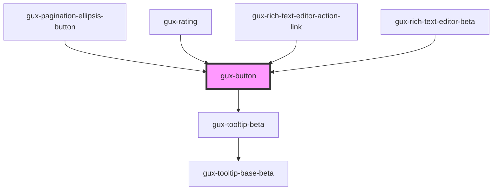

# gux-button

This custom component is a simple button having some styling on it.
You can choose between two type (secondary and primary).

<!-- Auto Generated Below -->

## Properties

| Property    | Attribute   | Description                               | Type                                                                        | Default       |
| ----------- | ----------- | ----------------------------------------- | --------------------------------------------------------------------------- | ------------- |
| `accent`    | `accent`    |                                           | `"danger" \| "ghost" \| "inline" \| "primary" \| "secondary" \| "tertiary"` | `'secondary'` |
| `autofocus` | `autofocus` |                                           | `boolean`                                                                   | `false`       |
| `disabled`  | `disabled`  | Indicate if the button is disabled or not | `boolean`                                                                   | `false`       |
| `guxTitle`  | `gux-title` | The component title                       | `string`                                                                    | `undefined`   |
| `type`      | `type`      | The component button type                 | `"button" \| "reset" \| "submit"`                                           | `'button'`    |

## Slots

| Slot | Description |
| ---- | ----------- |
|      | content     |

## Dependencies

### Used by

 - [gux-pagination-ellipsis-button](../gux-pagination/gux-pagination-buttons/gux-pagination-ellipsis-button)
 - [gux-rating](../gux-rating)
 - [gux-rich-text-editor-action-link](../../beta/gux-rich-text-editor/gux-rich-text-editor-action/gux-rich-text-editor-action-link)
 - [gux-rich-text-editor-beta](../../beta/gux-rich-text-editor)

### Depends on

- [gux-tooltip-beta](../../beta/gux-tooltip-beta)

### Graph

----------------------------------------------

*Built with [StencilJS](https://stenciljs.com/)*
