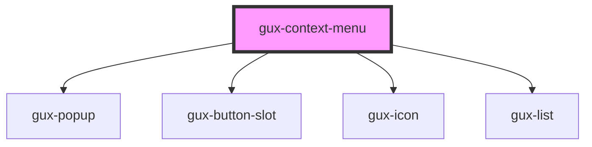

# gux-context-menu

<!-- Auto Generated Below -->

## Properties

| Property           | Attribute           | Description                                                                    | Type      | Default |
| ------------------ | ------------------- | ------------------------------------------------------------------------------ | --------- | ------- |
| `compact`          | `compact`           | Indicates button density style. Intended to be paired with gux-table property. | `boolean` | `false` |
| `disabled`         | `disabled`          | Controls the disabled state of the internal button                             | `boolean` | `false` |
| `screenreaderText` | `screenreader-text` | Screenreader text for context menu button defaults to "context menu"           | `string`  | `''`    |

## Dependencies

### Depends on

- [gux-popup](../gux-popup)
- [gux-button-slot](../gux-button-slot)
- [gux-icon](../gux-icon)
- [gux-list](../gux-list)

### Graph

----------------------------------------------

*Built with [StencilJS](https://stenciljs.com/)*
