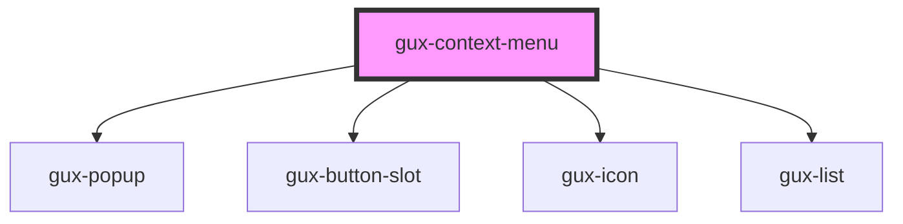

# gux-context-menu

<!-- Auto Generated Below -->

## Properties

| Property           | Attribute           | Description                                                          | Type     | Default |
| ------------------ | ------------------- | -------------------------------------------------------------------- | -------- | ------- |
| `screenreaderText` | `screenreader-text` | Screenreader text for context menu button defaults to "context menu" | `string` | `''`    |

## Dependencies

### Depends on

- [gux-popup](../../stable/gux-popup)
- [gux-button-slot](../../stable/gux-button-slot)
- [gux-icon](../../stable/gux-icon)
- [gux-list](../../stable/gux-list)

### Graph

----------------------------------------------

*Built with [StencilJS](https://stenciljs.com/)*
