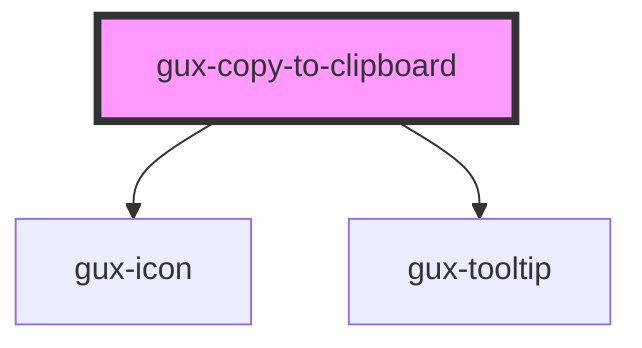

# gux-copy-to-clipboard

<!-- Auto Generated Below -->

## Slots

| Slot        | Description      |
| ----------- | ---------------- |
| `"content"` | Slot for content |

## CSS Custom Properties

| Name                                                           | Description                                     |
| -------------------------------------------------------------- | ----------------------------------------------- |
| `--gse-ui-copyToClipboard-contentContainer-gap`                | https://inindca.atlassian.net/browse/COMUI-2153 |
| `--gse-ui-copyToClipboard-gap`                                 | https://inindca.atlassian.net/browse/COMUI-2153 |
| `--gse-ui-copyToClipboard-iconContainer-padding`               |                                                 |
| `--gse-ui-copyToClipboard-label-active-backgroundColor`        |                                                 |
| `--gse-ui-copyToClipboard-label-borderRadius`                  |                                                 |
| `--gse-ui-copyToClipboard-label-foregroundColor`               |                                                 |
| `--gse-ui-copyToClipboard-label-padding`                       |                                                 |
| `--gse-ui-copyToClipboard-label-text-fontFamily`               |                                                 |
| `--gse-ui-copyToClipboard-label-text-fontSize`                 |                                                 |
| `--gse-ui-copyToClipboard-label-text-fontWeight`               |                                                 |
| `--gse-ui-copyToClipboard-label-text-lineHeight`               |                                                 |
| `--gse-ui-copyToClipboard-label-text-textDecoration`           |                                                 |
| `--gse-ui-copyToClipboard-tooltipIcon-error-foregroundColor`   |                                                 |
| `--gse-ui-copyToClipboard-tooltipIcon-success-foregroundColor` |                                                 |
| `--gse-ui-icon-size-sm`                                        |                                                 |

## Dependencies

### Depends on

- [gux-icon](../gux-icon)
- [gux-tooltip](../gux-tooltip)

### Graph

----------------------------------------------

*Built with [StencilJS](https://stenciljs.com/)*
