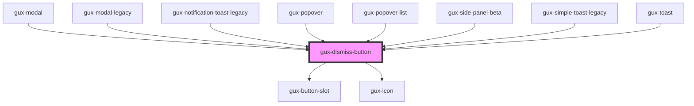

# gux-dismiss-button

This component is meant for use in other components as a dismiss button.

<!-- Auto Generated Below -->

## Properties

| Property   | Attribute  | Description | Type                      | Default      |
| ---------- | ---------- | ----------- | ------------------------- | ------------ |
| `position` | `position` |             | `"absolute" \| "inherit"` | `'absolute'` |
| `size`     | `size`     |             | `"medium" \| "small"`     | `'medium'`   |

## Dependencies

### Used by

 - [gux-modal](../gux-modal)
 - [gux-modal-legacy](../../legacy/gux-modal-legacy)
 - [gux-notification-toast-legacy](../../legacy/gux-notification-toast-legacy)
 - [gux-popover](../gux-popover)
 - [gux-popover-list](../gux-popover-list)
 - [gux-side-panel-beta](../../beta/gux-side-panel)
 - [gux-simple-toast-legacy](../../legacy/gux-simple-toast-legacy)
 - [gux-toast](../gux-toast)

### Depends on

- [gux-button-slot](../gux-button-slot)
- [gux-icon](../gux-icon)

### Graph

----------------------------------------------

*Built with [StencilJS](https://stenciljs.com/)*
