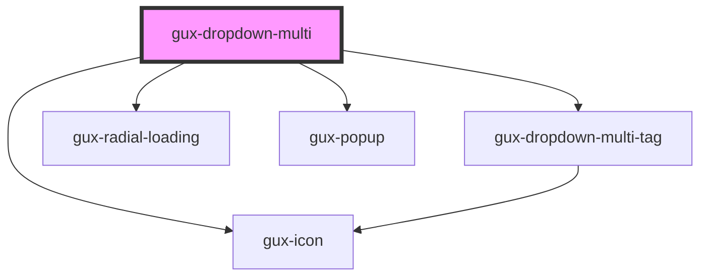

# gux-dropdown-multi

<!-- Auto Generated Below -->

## Properties

| Property            | Attribute             | Description                                                                                                                                               | Type                                  | Default     |
| ------------------- | --------------------- | --------------------------------------------------------------------------------------------------------------------------------------------------------- | ------------------------------------- | ----------- |
| `disabled`          | `disabled`            |                                                                                                                                                           | `boolean`                             | `false`     |
| `exceedTargetWidth` | `exceed-target-width` | allows dropdown popup to be wider than input defaults to fitting content if width is not specified for listbox default min-width is set to width of input | `boolean`                             | `false`     |
| `filterType`        | `filter-type`         | Override default filtering behavior                                                                                                                       | `"custom" \| "none" \| "starts-with"` | `'none'`    |
| `hasError`          | `has-error`           |                                                                                                                                                           | `boolean`                             | `false`     |
| `loading`           | `loading`             |                                                                                                                                                           | `boolean`                             | `false`     |
| `placeholder`       | `placeholder`         |                                                                                                                                                           | `string`                              | `undefined` |
| `required`          | `required`            |                                                                                                                                                           | `boolean`                             | `false`     |
| `value`             | `value`               |                                                                                                                                                           | `string`                              | `undefined` |

## Events

| Event             | Description                                                                   | Type                  |
| ----------------- | ----------------------------------------------------------------------------- | --------------------- |
| `guxcollapsed`    | This event will run when the dropdown-multi transitions to a collapsed state. | `CustomEvent<void>`   |
| `guxcreateoption` | This event is emitted to request creating a new option                        | `CustomEvent<any>`    |
| `guxexpanded`     | This event will run when the dropdown-multi transitions to an expanded state. | `CustomEvent<void>`   |
| `guxfilter`       |                                                                               | `CustomEvent<string>` |

## Methods

### `getSelectedValues() => Promise<string[]>`

Returns an array of the selected values

#### Returns

Type: `Promise<string[]>`

## Slots

| Slot | Description                                                  |
| ---- | ------------------------------------------------------------ |
|      | for a gux-listbox-multi containing gux-option-multi children |

## Dependencies

### Depends on

- [gux-dropdown-multi-tag](gux-dropdown-multi-tag)
- [gux-icon](../gux-icon)
- [gux-radial-loading](../gux-radial-loading)
- [gux-popup](../gux-popup)

### Graph

----------------------------------------------

*Built with [StencilJS](https://stenciljs.com/)*
