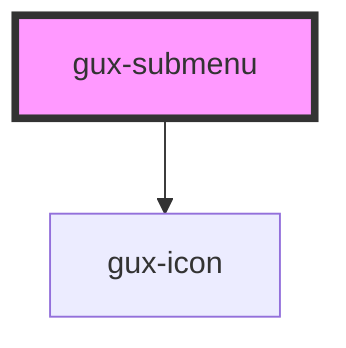

# gux-flyout-menu

<!-- Auto Generated Below -->

## Properties

| Property | Attribute | Description | Type     | Default     |
| -------- | --------- | ----------- | -------- | ----------- |
| `label`  | `label`   |             | `string` | `undefined` |

## Methods

### `guxFocus() => Promise<void>`

Focus on the components button element

#### Returns

Type: `Promise<void>`

## Slots

| Slot | Description                                 |
| ---- | ------------------------------------------- |
|      | collection of menu-option, submenu elements |

## Dependencies

### Depends on

- [gux-icon](../../../gux-icon)

### Graph

----------------------------------------------

*Built with [StencilJS](https://stenciljs.com/)*
