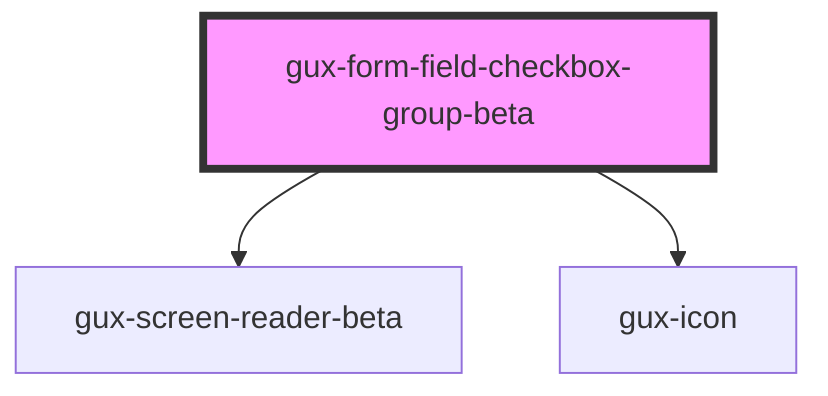

# gux-form-field-checkbox-group

<!-- Auto Generated Below -->

## Properties

| Property   | Attribute  | Description                           | Type      | Default |
| ---------- | ---------- | ------------------------------------- | --------- | ------- |
| `disabled` | `disabled` | Disables the checkboxes in the group. | `boolean` | `false` |

## Slots

| Slot               | Description                     |
| ------------------ | ------------------------------- |
| `"group-checkbox"` | Optional slot                   |
| `"group-error"`    | Optional slot for error message |
| `"group-help"`     | Optional slot for help message  |
| `"group-label"`    | Required slot for label tag     |

## Dependencies

### Depends on

- [gux-screen-reader-beta](../../../../beta/gux-screen-reader)
- [gux-icon](../../../gux-icon)

### Graph

----------------------------------------------

*Built with [StencilJS](https://stenciljs.com/)*
