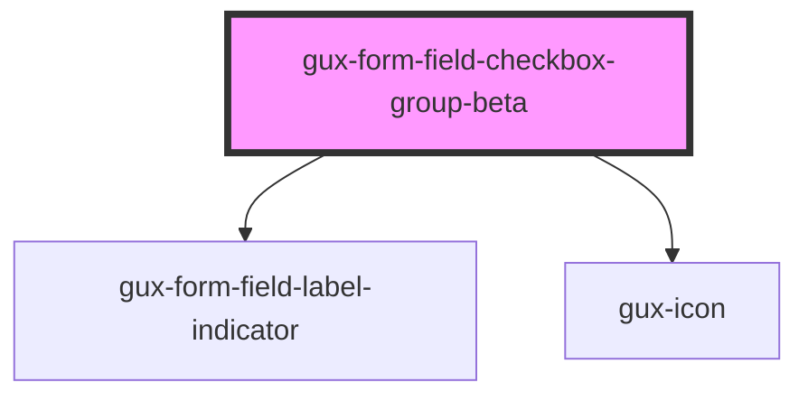

# gux-form-field-checkbox-group

<!-- Auto Generated Below -->

## Properties

| Property        | Attribute        | Description                                                                                                                                                                                                                                                                     | Type                       | Default      |
| --------------- | ---------------- | ------------------------------------------------------------------------------------------------------------------------------------------------------------------------------------------------------------------------------------------------------------------------------- | -------------------------- | ------------ |
| `disabled`      | `disabled`       | Disables the checkboxes in the group.                                                                                                                                                                                                                                           | `boolean`                  | `false`      |
| `indicatorMark` | `indicator-mark` | Field indicator mark which can show *, (optional) or blank Defaults to required. When set to required, the component will display * for required fields and blank for optional When set to optional, the component will display (optional) for optional and blank for required. | `"optional" \| "required"` | `'required'` |
| `required`      | `required`       |                                                                                                                                                                                                                                                                                 | `boolean`                  | `false`      |

## Slots

| Slot               | Description                     |
| ------------------ | ------------------------------- |
| `"group-checkbox"` | Optional slot                   |
| `"group-error"`    | Optional slot for error message |
| `"group-help"`     | Optional slot for help message  |
| `"group-label"`    | Required slot for label tag     |

## Dependencies

### Depends on

- [gux-form-field-label-indicator](../../helper-components/gux-form-field-optional-indicator)
- [gux-icon](../../../gux-icon)

### Graph

----------------------------------------------

*Built with [StencilJS](https://stenciljs.com/)*
