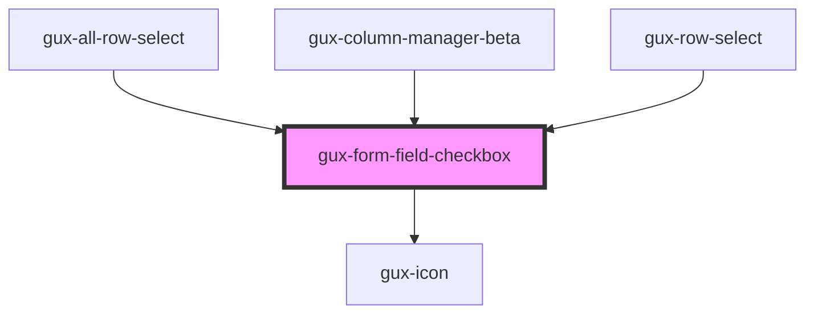

# gux-form-field-checkbox

<!-- Auto Generated Below -->

## Slots

| Slot      | Description                     |
| --------- | ------------------------------- |
| `"error"` | Optional slot for error message |
| `"help"`  | Optional slot for help message  |
| `"input"` | Required slot for input tag     |
| `"label"` | Required slot for label tag     |

## Dependencies

### Used by

 - [gux-all-row-select](../../../gux-table/gux-all-row-select)
 - [gux-column-manager-beta](../../../../beta/gux-column-manager)
 - [gux-row-select](../../../gux-table/gux-row-select)

### Depends on

- [gux-icon](../../../gux-icon)

### Graph

----------------------------------------------

*Built with [StencilJS](https://stenciljs.com/)*
