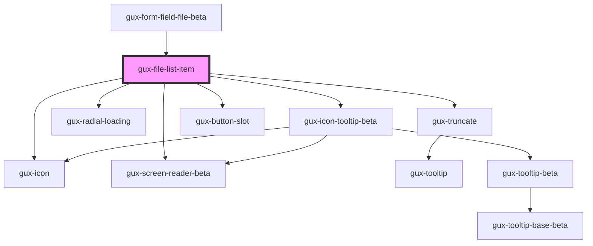

# gux-file-list-item

<!-- Auto Generated Below -->

## Properties

| Property             | Attribute  | Description | Type                                             | Default     |
| -------------------- | ---------- | ----------- | ------------------------------------------------ | ----------- |
| `disabled`           | `disabled` |             | `boolean`                                        | `false`     |
| `index` _(required)_ | `index`    |             | `number`                                         | `undefined` |
| `name` _(required)_  | `name`     |             | `string`                                         | `undefined` |
| `status`             | `status`   |             | `"default" \| "error" \| "loading" \| "success"` | `undefined` |

## Events

| Event           | Description | Type                  |
| --------------- | ----------- | --------------------- |
| `guxremovefile` |             | `CustomEvent<number>` |

## Dependencies

### Used by

 - [gux-form-field-file-beta](../..)

### Depends on

- [gux-truncate](../../../../../gux-truncate)
- [gux-radial-loading](../../../../../gux-radial-loading)
- [gux-icon-tooltip-beta](../../../../../../beta/gux-icon-tooltip)
- [gux-button-slot](../../../../../gux-button-slot)
- [gux-icon](../../../../../gux-icon)
- [gux-screen-reader-beta](../../../../../../beta/gux-screen-reader)

### Graph

----------------------------------------------

*Built with [StencilJS](https://stenciljs.com/)*
